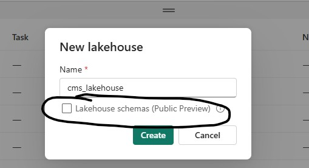

## Create Lakehouse and setup Spark Notebooks

In this step you will create Lakehouse and setup Spark Notebooks to be used for downloading csv files and creation of Lakehouse Tables (Delta Parquet) from those files 

1. Open your Fabric Workspace and switch to Data Engineering persona using the menu on bottom left corner (the screenshot below shows the buttons for Lakehouse creation and Notebook Import) 
   
    

2. Create a new Lakehouse with name **cms_lakehouse** if not using an existing Lakehouse, when creating new Lakehouse make sure to leave the Lakehouse Schema checkbox unchecked as shown in the screenshot below)

    

3. Open [01-DownloadCMSDataCsvFiles](../01-DownloadCMSDataCsvFiles.ipynb) Spark Notebook from the GitHub Repo and download to local machine using the *Download Raw File* button on top right corner as shown in the screenshot below

    

4. Repeat download step for [02-CreateCMSDataTable](../02-CreateCMSDataTable.ipynb) and [03-CreateCMSStarSchemaTables](../03-CreateCMSStarSchemaTables.ipynb) Spark Notebooks
   
5. Import the three downloaded Notebooks into Fabric Workspace (screenshot in Step 1 for *Import Notebook* button)

6. Once the import is successful Open **01-DownloadCMSDataCsvFiles** Notebook, you will need to select Lakehouse option and then **fix the Lakehouse association of the Notebook** by first clicking **Remove All Lakehouses** button then adding the Lakehouse created in Step 2 using **Add Lakehouse** button
    
    

    

7. Repeat Step 6 for **02-CreateCMSDataTable** and **03-CreateCMSStarSchemaTables** Notebooks

***
[Back to main Readme](../Readme.md#step-1-create-lakehouse-and-setup-spark-notebooks)
